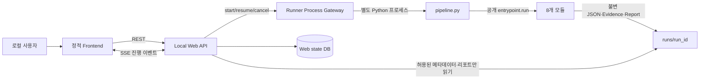

# ABC2LAB 로컬 웹 통합 설계안

> 상태: 구현 전 설계 문서
>
> 기준: `docs/spec/`의 인터페이스 명세 v0.1과 각 모듈의 공개
> `entrypoint.run(operation, input_paths, output_dir, context)` 계약

## 1. 목표

8개 진단 모듈을 통합한 뒤 사용자가 브라우저에서 다음 작업을 수행할 수 있는
온프레미스 로컬 웹을 만든다.

- 진단 실행 생성과 시작
- 모듈별 진행 상태와 오류 확인
- Safety Policy의 승인 대기 항목 확인과 승인 제출
- 진단 리포트와 개발 평가 결과 열람
- 이전 실행 목록과 실행별 산출물 상태 확인

로컬 웹은 새로운 진단 모듈이 아니다. 진단·추론·정책·검증·평가 로직을 갖지
않고, 기존 모듈을 실행하고 결과를 사용자에게 보여주는 통합 애플리케이션이다.

## 2. 핵심 원칙

1. 프론트엔드는 화면 표시와 사용자 입력만 담당한다.
2. 웹 백엔드는 실행 요청, 프로세스 수명, 진행 상태 전달, 읽기 전용 화면 변환만
   담당한다.
3. 파이프라인 순서와 모듈 호출은 관리자 소유 runner가 담당한다.
4. 모듈의 내부 `service`, `utils`, Schema, DB driver, 브라우저 객체를 웹에서
   import하지 않는다.
5. 모듈 호출은 공개 entrypoint 또는 공개 CLI만 사용한다.
6. 모듈 산출물은 단일 작성자가 만든 불변 파일이며 웹은 수정하지 않는다.
7. 실행 허용은 웹이나 LLM이 아니라 `safety_policy`가 결정한다.
8. 인증정보·쿠키·토큰·비밀번호는 API 응답, 브라우저 상태, 이벤트, 로그,
   실행 메타데이터에 넣지 않는다.
9. 테스트 앱의 URL·셀렉터·계정·엔드포인트·배열 위치를 웹 코드에 고정하지 않는다.
10. 첫 구현은 단일 호스트·단일 사용자·한 번에 한 실행으로 시작하고, 동시 실행은
    실제 자원 격리 검증 후 확장한다.

## 3. 권장 구조



권장 경계는 다음과 같다.

| 계층 | 책임 | 하지 않는 일 |
| --- | --- | --- |
| Frontend | 입력 폼, 진행 화면, 승인 화면, 결과 화면 | 파일 경로 계산, 모듈 호출, Safety 판정, JSON 계약 해석 |
| Local Web API | HTTP 검증, runner 시작, 이벤트 전달, 화면 DTO 생성 | 취약점 판정, Cypher, LLM 호출, 검증 요청 실행 |
| Runner gateway | 별도 프로세스 실행·종료 코드·stdout 이벤트 수집 | 모듈 업무 데이터 수정 |
| `pipeline.py` | 호출 순서, 입력 경로와 제어 응답 전달, pause/resume | 모듈별 Schema·업무 결과 해석 |
| 각 모듈 | 입력 검증, 실제 처리, 출력 검증·저장 | 다음 모듈 실행, UI 상태 관리 |
| Reporter | 사용자용 진단 HTML·평가 JSON 생성 | 웹 화면 라우팅, 실행 제어 |

### 왜 웹 백엔드가 모듈을 직접 import하지 않는가

웹 서버 프로세스에서 8개 모듈을 직접 실행하면 브라우저·Neo4j·LLM 작업이 서버
이벤트 루프와 수명을 공유한다. 한 모듈의 crash, 환경변수 변경, 긴 실행이 웹
응답 전체에 영향을 줄 수 있다.

따라서 백엔드는 `pipeline.py`를 별도 Python 프로세스로 실행하는 방식을 우선한다.
runner만 공개 entrypoint를 호출하고, 웹은 버전이 있는 작은 runner 이벤트 규약만
소비한다. 이 구조는 모듈 구현 변경이 웹으로 전파되는 범위를 줄인다.

## 4. 제안 디렉터리

구현 시 다음처럼 웹 전용 파일을 분리한다. 기존 `modules/*`는 수정하지 않는다.

```text
local_web/
├── README.md
├── requirements.txt          # 실제 채택 후 직접 의존성만 선언
├── backend/
│   ├── app.py                # HTTP 앱 생성·정적 파일 mount
│   ├── api/
│   │   ├── runs.py           # 실행 생성·조회·시작·취소
│   │   ├── approvals.py      # 승인 대기 조회·승인 제출
│   │   └── reports.py        # 리포트·평가 조회
│   ├── application/
│   │   ├── run_coordinator.py
│   │   └── state_machine.py
│   ├── adapters/
│   │   ├── runner_gateway.py
│   │   ├── safety_presenter.py
│   │   └── reporter_presenter.py
│   ├── infrastructure/
│   │   ├── process_executor.py
│   │   ├── event_stream.py
│   │   ├── state_store.py
│   │   └── path_guard.py
│   └── schemas/              # 웹 API DTO만. 모듈 Schema를 복사하지 않음
├── frontend/
│   ├── index.html
│   ├── app.js
│   └── styles.css
└── tests/
    ├── fixtures/
    ├── test_api_*.py
    ├── test_runner_gateway.py
    ├── test_state_machine.py
    └── test_security.py
```

루트 `README.md`, `pipeline.py`, `requirements.txt`, `requirements.lock.txt`는 GitHub
관리자 수정 범위다. 웹 구현에서 이 파일의 변경이 필요하면 관리자 PR에서
반영한다. `local_web`은 8개 모듈의 내부 공통 라이브러리가 되어서는 안 된다.

## 5. 기술 선택

### 5.1 프론트엔드

1차 구현은 정적 HTML, CSS, 브라우저 표준 JavaScript ES module을 권장한다.

- Node·번들러 없이 폐쇄망 배포 가능
- 화면 수가 적은 1차 범위에 충분
- 백엔드가 만든 화면 DTO만 렌더링
- 상태는 URL과 메모리에만 두고 비밀값을 localStorage에 저장하지 않음

진단 그래프 시각화나 복잡한 비교 화면이 실제로 필요해질 때 React/Vue 등의 도입을
별도 결정한다. 프레임워크 도입 자체를 1차 통합의 선행 조건으로 두지 않는다.

### 5.2 백엔드

HTTP API와 SSE 구현에는 FastAPI + Uvicorn이 적합하다. 다만 현재 팀 공통 잠금
환경에는 웹 앱 의존성이 없으므로 실제 버전은 관리자와 합의한 뒤
`local_web/requirements.txt`와 루트 lock에 함께 반영한다.

- REST: 사용자 명령과 조회
- SSE(Server-Sent Events): 서버에서 브라우저로 보내는 단방향 진행 상태
- SQLite: 실행 메타데이터와 이벤트 cursor 저장
- `subprocess`: runner 프로세스 격리

WebSocket은 1차 범위에서 쓰지 않는다. 진행 상태는 단방향이고, 승인·취소는 일반
POST 요청으로 충분하다. SSE 연결이 끊기면 마지막 event ID 이후를 다시 받거나
상태 API를 polling한다.

### 5.3 상태 저장

웹 상태 DB에는 다음 메타데이터만 저장한다.

- web job ID와 `run_id`
- mode, iteration, 대상 origin의 비밀값 없는 표시 정보
- 현재 파이프라인 단계와 상태
- runner PID·시작/종료 시각·종료 코드
- 공개 제어 응답의 status, artifact ID, 상대 경로, SHA-256
- 승인 요청의 공개 ID·상태·감사 메타데이터

모듈 산출물 본문, Evidence 본문, 쿠키, 토큰, 비밀번호는 복사하지 않는다. DB 위치는
배포 설정으로 지정하고 Git에서 제외한다. 실행 결과의 원본은 계속
`runs/<run_id>/`가 소유한다.

## 6. Runner와 웹 사이의 규약

모듈별 공개 응답은 현재 조금씩 다르므로 웹이 각 응답을 직접 해석하지 않는다.
관리자 소유 runner가 모듈 공개 응답을 다음의 웹 전용 이벤트로 정규화한다.
이 이벤트는 모듈 JSON 계약이 아니라 runner↔web 통합 계약이다.

```json
{
  "protocol_version": "1",
  "event_id": 12,
  "event": "step_finished",
  "run_id": "run_20261007_001",
  "iteration": 0,
  "module_id": "semantic_analyzer",
  "operation": "analyze",
  "status": "completed",
  "artifact_id": "semantic_analysis_run_20261007_001_000",
  "output_path": "artifacts/iteration-000/semantic_analyzer/semantic_analysis.json",
  "sha256": "<64자리 SHA-256>",
  "errors": [],
  "occurred_at": "2026-10-07T12:00:00Z"
}
```

지원할 이벤트는 최소한 다음과 같다.

| event | 의미 |
| --- | --- |
| `pipeline_started` | runner가 실행 요청을 검증하고 시작함 |
| `step_started` | 모듈 operation 호출 직전 |
| `step_finished` | 공개 제어 응답을 수신함 |
| `approval_required` | Safety 결과로 사용자 입력을 기다림 |
| `pipeline_paused` | 재시작 가능한 지점에서 종료함 |
| `pipeline_finished` | 전체 호출 완료 |
| `pipeline_failed` | 다음 단계를 시작할 수 없는 제어 실패 |

stdout에는 JSON Lines 이벤트만 쓰고 사람용 로그는 stderr로 분리한다. 이벤트에는
모듈 출력의 `data`, 헤더, 쿠키, 토큰, 비밀번호, 요청·응답 본문을 넣지 않는다.

### 실행 요청

웹은 runner에 비밀값 없는 요청만 전달한다.

```json
{
  "protocol_version": "1",
  "command": "start",
  "run_id": "run_20261007_001",
  "mode": "diagnosis",
  "iteration": 0,
  "target_url": "http://target.internal",
  "collector_profile": "internal_shop",
  "policy_profile": "default_safe",
  "dataset_id": null
}
```

프로필 ID는 서버 설정의 allowlist에서 신뢰 경로로 변환한다. 브라우저가 임의의
파일 경로를 runner에 전달할 수 없게 한다. 계정 비밀번호와 모델 키는 환경변수나
모듈 소유 private 설정으로 준비하고 요청 JSON에는 넣지 않는다.

## 7. 파이프라인 실행 순서

runner는 업무 내용을 판정하지 않고 다음 공개 operation을 순서대로 연결한다.

```text
collector.collect
  → semantic_analyzer.analyze
  → knowledge_graph.ingest
  → access_analyzer.prepare_queries
  → knowledge_graph.query
  → access_analyzer.analyze
  → scenario_generator.generate
  → safety_policy.evaluate
  → [승인 대기 시 pause / 승인 입력 후 safety_policy.evaluate 재발행]
  → verifier.verify
  → knowledge_graph.apply_verification
  → reporter.report
  → reporter.evaluate (development 모드만)
```

연결 시 runner가 보는 값은 공개 제어 응답의 상태·경로·해시와 KG의
`graph_id/revision`뿐이다. 산출물의 업무 필드는 해당 소비 모듈이 자기 입력
adapter에서 검증한다.

- `completed`: 다음 의존 단계 실행
- `partial`이며 출력 경로가 있음: 다음 소비자가 처리하도록 그대로 전달
- `failed`이며 실패 artifact가 있음: 계약상 해당 파일을 읽는 소비자에게 전달 가능
- 출력이 발행되지 않음: 그 파일에 의존하는 분기를 중단
- 재실행: 기존 완료 파일을 덮지 않고 새 iteration으로 시작

정확한 계속/중단 표는 각 공개 entrypoint의 완료 응답이 확정된 후 runner
테스트 fixture로 고정한다. runner가 빈 기본 JSON을 만들어 실패를 숨기면 안 된다.

## 8. 승인 흐름

`require_approval`은 장시간 runner 프로세스를 열린 채 기다리지 않는다.

1. `safety_policy.evaluate`가 판정 파일을 발행한다.
2. runner가 `approval_required`와 `pipeline_paused` 이벤트를 내고 정상 종료한다.
3. 웹은 `safety_decisions.json`의 공개된 승인 대기 정보만 화면 DTO로 변환한다.
4. 사용자가 승인 또는 거절한다.
5. 백엔드는 승인 기록을 Safety Policy의 합의된 공개 창구로 제출한다.
6. runner를 `resume` 명령으로 새로 실행한다.
7. `safety_policy`가 계획 해시·Policy 버전·승인 범위를 재검증하고 새 판정을 발행한다.
8. `allow`인 시나리오만 verifier로 전달한다.

웹은 `safety_decisions.json`을 수정하거나 `require_approval`을 `allow`로 바꾸지 않는다.
승인으로도 `block`이나 `unknown`을 우회하지 않는다.

승인자의 신원 확인, 승인 기록 생성 주체, 서명·만료, 승인 후 iteration 발행 방식은
현재 열린 결정이다. 이 규약이 합의되기 전에는 UI를 읽기 전용 승인 대기 화면으로
구현하고 실제 승인 버튼은 활성화하지 않는다.

## 9. Web API 초안

### 실행

| Method | Path | 역할 |
| --- | --- | --- |
| `POST` | `/api/runs` | 비밀값 없는 실행 설정으로 job 생성 |
| `GET` | `/api/runs` | 실행 목록 조회 |
| `GET` | `/api/runs/{run_id}` | 현재 상태와 단계 목록 조회 |
| `POST` | `/api/runs/{run_id}/start` | runner 시작 |
| `POST` | `/api/runs/{run_id}/resume` | 승인 후 중단 지점부터 재개 |
| `POST` | `/api/runs/{run_id}/cancel` | 다음 안전한 단계 경계에서 취소 요청 |
| `GET` | `/api/runs/{run_id}/events` | SSE 진행 이벤트 |

1차 취소는 현재 모듈을 강제 종료하지 않고 단계 사이에서만 적용한다. DB transaction,
브라우저 세션, 원자 저장 중 process kill로 상태가 모호해지는 것을 피하기 위해서다.

### 승인·결과

| Method | Path | 역할 |
| --- | --- | --- |
| `GET` | `/api/runs/{run_id}/approvals` | 승인 대기 화면 DTO 조회 |
| `POST` | `/api/runs/{run_id}/approvals` | 합의된 승인 기록 제출 |
| `GET` | `/api/runs/{run_id}/artifacts` | 공개 artifact 메타데이터 조회 |
| `GET` | `/api/runs/{run_id}/report` | reporter가 만든 로컬 HTML 제공 |
| `GET` | `/api/runs/{run_id}/evaluation` | 개발 평가 화면 DTO 조회 |
| `GET` | `/api/runs/{run_id}/evidence/{evidence_id}` | 허용된 EvidenceRef만 제공 |

Frontend는 `runs/` 경로나 JSON 파일을 직접 열지 않는다. Backend presenter가
`diagnosis_report`, `evaluation_results`, 승인 대기용 `safety_decisions`의 합의된
필드만 읽어 웹 DTO로 만든다. 이 세 파일의 계약이 바뀌면 local web도 직접
소비자로서 변경 검토에 참여한다.

## 10. 화면 구성

### 10.1 실행 목록

- run ID, mode, 대상 origin, 생성 시각, 현재 상태
- `queued`, `running`, `waiting_approval`, `completed`, `partial`, `failed`,
  `cancelled` 필터
- 새 진단 버튼

### 10.2 새 진단

- 대상 URL
- 진단/development mode
- collector 설정 프로필
- Safety Policy 프로필
- development일 때 dataset ID와 matching profile
- 예상 대상 origin과 실행 제한 최종 확인

계정 비밀번호·토큰 입력은 1차 화면에서 받지 않는다. 서버에 미리 준비한 비밀 설정
프로필을 선택하게 한다.

### 10.3 실행 상세

- 8개 모듈 timeline과 operation별 상태
- 시작·종료 시각, partial/failed 오류 요약
- 승인 대기 banner
- 진단 리포트·평가 결과 링크
- 개발 모드에서만 artifact 메타데이터와 SHA-256 표시

### 10.4 승인

- scenario ID, 차단/승인 이유, 예상 영향, 요청 수 제한
- 계획 SHA-256과 Policy 버전
- 승인 범위·만료 시각 확인
- 승인/거절 동작과 감사 기록

### 10.5 결과

- Reporter HTML을 sandboxed iframe 또는 별도 로컬 경로로 표시
- 진단 상태 6종과 limitations 표시
- development 모드에서는 원시 분자·분모와 미검증 수 표시
- 미실행·판단불가를 취약점 없음으로 표시하지 않음

## 11. 보안 기준

### 네트워크

- 기본 bind는 `127.0.0.1`만 허용
- 기본 포트는 설정으로 받고 코드에 고정하지 않음
- Host와 Origin allowlist 검증
- 상태 변경 API에 CSRF 방어 적용
- LAN 공개가 필요하면 앱 자체 임시 기능 대신 인증·TLS reverse proxy를 먼저 구성

### 파일

- API의 `run_id`, artifact path, Evidence path를 그대로 `Path`에 붙이지 않음
- 신뢰 루트 아래 상대 경로만 허용
- `..`, 절대경로, 다른 run, 루트 밖 symlink 거절
- `runs/` 전체를 static directory로 노출하지 않음
- control response로 받은 경로와 합의된 reporter/EvidenceRef만 개별 제공
- HTML 리포트는 CSP와 iframe sandbox를 유지

### 비밀값·로그

- 요청 body와 환경변수 전체를 로그로 남기지 않음
- Authorization, Cookie, Set-Cookie, token, password 값 필터링
- 프론트 localStorage/sessionStorage에 비밀값 저장 금지
- 오류 응답에 내부 절대경로·stack trace·계정 원문을 포함하지 않음
- runner stderr는 비밀값 필터 후 실행별 로그에 저장

### 실행 권한

- module ID와 operation은 서버 allowlist만 사용
- 사용자가 Python import 경로·shell command·Cypher를 전달할 수 없음
- shell 문자열 조합 대신 고정 argv 배열로 subprocess 실행
- Safety `allow`와 정확한 scenario SHA-256이 없으면 verifier 호출 금지
- 상태 변경 허용 시 테스트 DB reset 완료 이벤트를 확인한 뒤 verifier 실행

## 12. 오류와 재시작

웹의 job 상태와 모듈 artifact 상태를 합치지 않는다.

- 웹 job `failed`: runner를 계속할 수 없음
- artifact `failed`: 모듈이 유효한 failed 파일을 발행했을 수 있음
- artifact `partial`: 일부 결과와 errors를 함께 보존
- vulnerability result: 취약점 재현 결과이며 위 상태와 별개

웹 서버 재시작 시 SQLite의 마지막 event ID와 실제 runner process 상태를 대조한다.
이미 종료된 runner를 `running`으로 두지 않는다. 완료 파일이 있는 단계를 다시
실행하지 않고, resume 가능한 명시적 단계에서만 재개한다.

같은 iteration의 완료 파일은 덮어쓰지 않는다. 사용자가 다시 시도하면 새
iteration을 만들고 기존 실행 이력을 보존한다.

## 13. 테스트 전략

### Backend 단위 테스트

- 가짜 runner로 상태 전이 검증
- completed/partial/failed/미발행 응답 처리
- SSE 재연결과 event ID 순서
- start 중복 호출·동시 실행 제한
- 승인 전 resume 거절
- cancel은 단계 경계에서만 적용

### 경계 테스트

- runner JSONL protocol의 필수 필드·버전·중복 event ID 검증
- 모듈 control response 변화에 대한 module adapter 테스트
- Reporter HTML·평가 DTO·Safety 승인 DTO fixture 수신 테스트
- 다른 모듈 실제 소스 없이 공개 응답 fixture로 실행 가능해야 함

### 보안 테스트

- path traversal, 절대경로, 외부 symlink
- 임의 module/operation/command 실행 시도
- Host/Origin/CSRF 검증
- 로그·API·SSE·SQLite의 비밀값 누출 검사
- HTML 문자열 escape와 CSP 확인
- 동일 run 동시 start와 불변 파일 overwrite 방지

### 실제 통합 테스트

- secure/vulnerable 테스트 앱 각각 end-to-end 실행
- Neo4j·브라우저·로컬 LLM 의존성 실패
- 승인 대기 → 승인 → 재평가 → verifier 실행
- server clock regression 시 결과 폐기와 재실행
- reporter report와 development evaluate까지 실제 산출물로 확인

## 14. 구현 단계

### 0단계 — 통합 계약 확정

- [ ] 8개 모듈 공개 entrypoint의 인자와 제어 응답 목록 작성
- [ ] `access_analyzer`, `verifier` 공개 실행 구현 완료 확인
- [ ] collector↔verifier 세션 창구 합의
- [ ] runner의 KG `graph_id/revision` 전달 규약 확인
- [ ] 승인 기록 생성·신원·만료·resume 규약 합의
- [ ] runner↔web JSONL protocol v1 확정

이 단계에서는 모듈 출력 Schema를 웹 편의를 위해 변경하지 않는다.

### 1단계 — UI shell과 가짜 runner

- [ ] 정적 frontend와 REST/SSE backend 골격
- [ ] SQLite job/event 저장
- [ ] 가짜 runner로 실행 목록·상세·진행 timeline 구현
- [ ] 읽기 전용 승인 대기 화면과 결과 화면 구현
- [ ] path/origin/secret logging 보안 테스트

### 2단계 — 실제 runner 연결

- [ ] backend가 `pipeline.py`를 고정 argv로 실행
- [ ] stdout JSONL·stderr 분리 수집
- [ ] 모듈별 제어 응답 adapter 구현
- [ ] completed/partial/failed/미발행 분기 검증
- [ ] 한 번에 한 run 제한으로 실제 모듈 연결

### 3단계 — 승인·resume

- [ ] 합의된 승인 기록 writer/public endpoint 연결
- [ ] waiting_approval 상태와 감사 로그
- [ ] Safety Policy 재평가 후 allow만 verifier로 전달
- [ ] 상태 변경 허용 시 DB reset gate 구현

### 4단계 — 리포트·개발 평가

- [ ] Reporter HTML 안전 제공
- [ ] evaluation_results 화면 DTO
- [ ] artifact/Evidence 개별 다운로드와 경로 방어
- [ ] secure/vulnerable 전체 실행 비교

### 5단계 — 배포

- [ ] 관리자 승인 의존성과 공통 lock 반영
- [ ] 폐쇄망용 frontend asset·Python wheel·Chromium·Neo4j·모델 준비
- [ ] 단일 시작 명령과 health check
- [ ] 백업·보존 기간·로그 rotation
- [ ] Ubuntu 24.04 x86_64 설치본 검증

## 15. 완료 기준

- [ ] frontend가 모듈 JSON·경로·Safety 규칙을 해석하지 않는다.
- [ ] backend가 모듈 내부 구현을 import하지 않고 runner 프로세스만 제어한다.
- [ ] runner는 공개 entrypoint와 제어 응답만 연결한다.
- [ ] 기존 8개 모듈 코드와 v0.1 출력 Schema 변경 없이 전체 진단이 실행된다.
- [ ] partial·failed·미발행·승인 대기가 화면에서 서로 구분된다.
- [ ] 미실행·판단불가가 취약점 없음으로 표시되지 않는다.
- [ ] 승인 없이 verifier 요청이 발생하지 않는다.
- [ ] 비밀값이 API·SSE·로그·DB·HTML에 남지 않는다.
- [ ] 대상 origin 밖 요청과 신뢰 루트 밖 파일 접근이 차단된다.
- [ ] 실제 테스트 앱에서 report까지, development 모드에서는 evaluate까지 완료된다.
- [ ] 웹을 제거해도 각 모듈과 CLI 독립 실행이 그대로 유지된다.

## 16. 구현 전에 확정할 결정

1. 로컬 웹과 `pipeline.py`의 담당자·리뷰어
2. runner JSONL protocol과 exit code
3. 승인자의 신원 확인·승인 기록 생성 주체·서명·만료
4. backend가 읽기 전용 직접 소비자가 될 파일 범위
5. 단일 사용자 이후 동시 실행 수와 Neo4j graph·브라우저·LLM 자원 격리
6. 웹 상태 DB 위치, 보존 기간, 삭제·백업 정책
7. FastAPI/Uvicorn 버전과 공통 lock 반영 주체
8. LAN 공개 여부와 인증·TLS 배치 방식

이 결정이 필요한 이유는 UI 편의가 기존 모듈의 실행 허용·계약·비밀값 경계를
우회하지 않도록 하기 위해서다.
